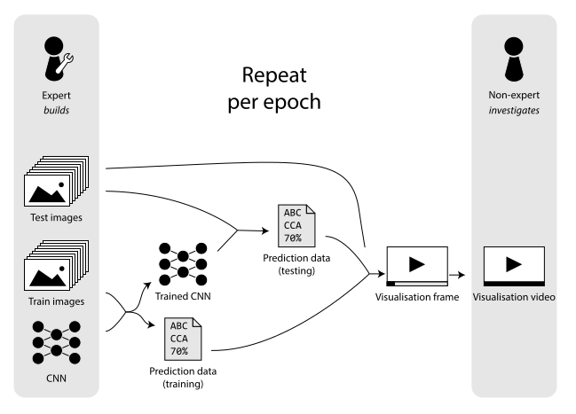

# TrainVideo :chart_with_upwards_trend::film_strip:

This tool creates videos to visualize the training process of a convolutional neural network.  
It is developed as part of a research paper.

:page_facing_up: _Neural Networks for Non-Experts: Intuitively Visualising the Training Process Over Time_ (Peters et al., 2019)  
:pencil2: Main authors: Michelle Peters & Lindsay Kempen  

## Paper abstract
Convolutional neural networks are very complex and not easily interpretable by humans. Several tools give more insight into the training process and decision making of neural networks but are not understandable for people with no or limited knowledge about artificial neural networks. Since these non-experts sometimes do need to rely on the decisions of a neural network, we developed an open-source tool that intuitively visualises the training process of a neural network. We visualize neuron activity using the dimensionality reduction method UMAP. By plotting neuron activity after every epoch, we create a video that shows how the neural network improves itself throughout the training phase. We evaluated our method by analysing the visualization on a CNN training on a sketch data set. We show how a video of the training over time gives more insight than a static visualisation at the end of training, as well as which features are useful to visualise for non-experts. We conclude that most of the useful deductions made from the videos are suitable for non-experts, which indicates that the visualization tool might be helpful in practice.

## Instructions
Python 3.7 is advised. Several libraries are necessary, such as Pytorch (neural network) and OpenCV (video making).  
Below, you can click the files to navigate to them.

### Run it
1. Run `python training_visualisation.py` to create visualisations on pre-specified parameters
2. Visualisation frames are in the `output` folder.
3. To make a video from the frames, run `python video.py`

### Tweak it
- Tweak the program parameters in [`const.py`](const.py) where desired. It contains CNN parameters, visualization parameters, and more. 
- Change the image classes?
    1. Create a new training subset and testing subset in the `data` folder
    2. If desired, you can transform the training images using `transform_images.py`
    3. Update `num_classes`, `train_dir` and `test_dir` in [`const.py`](const.py)

## Copyright

### Data set
We trained our CNN on the sketch dataset. The sketch dataset is licensed under a [Creative Commons Attribution 4.0 International License](https://creativecommons.org/licenses/by/4.0/). Copyright (C) [2012 Mathias Eitz, James Hays, and Marc Alexa. 2012. How Do Humans Sketch Objects? ACM Trans. Graph. (Proc. SIGGRAPH) 31, 4 (2012), 44:1--44:10](http://cybertron.cg.tu-berlin.de/eitz/projects/classifysketch/). The data has been modified from original by splitting the images in train sets and test sets, and subsets.

### This program
Visualizing the training process of a convolutional neural network over time.  
Copyright (C) 2019  Michelle Peters & Lindsay Kempen

This program is free software: you can redistribute it and/or modify it under the terms of the GNU General Public License as published by 
the Free Software Foundation, either version 3 of the License, or
(at your option) any later version.  
This program is distributed in the hope that it will be useful, but WITHOUT ANY WARRANTY; without even the implied warranty of MERCHANTABILITY or FITNESS FOR A PARTICULAR PURPOSE. See the GNU General Public License for more details.  
You should have received a copy of the GNU General Public License along with this program. If not, see <https://www.gnu.org/licenses/>.
